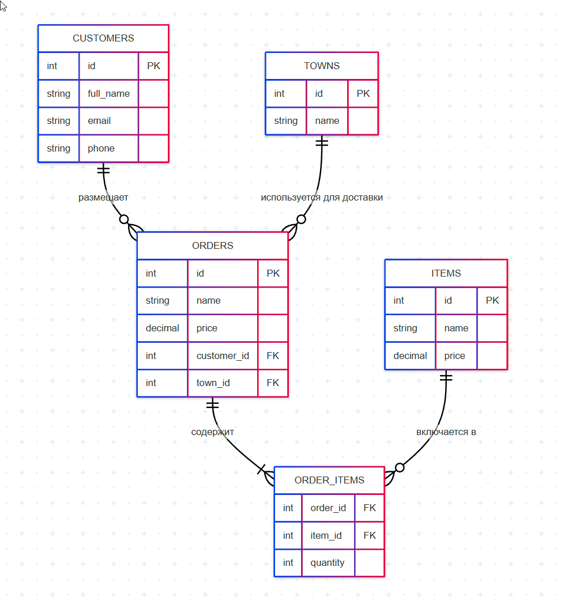
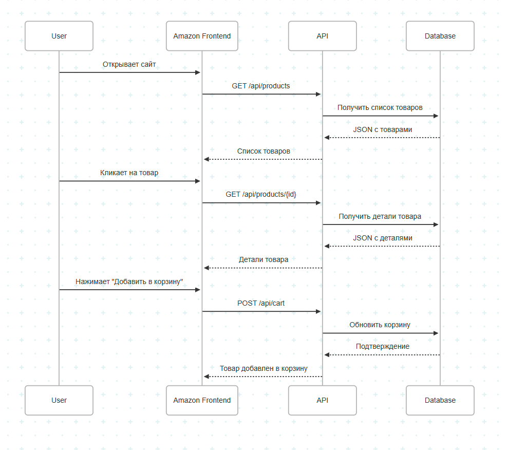
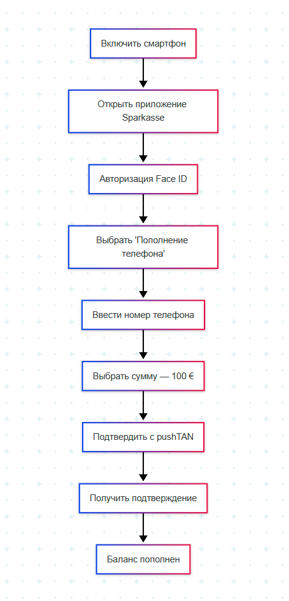

# 📊 Systems Analysis — Test Assignment

This section contains a complete solution to a systems analysis case. It includes test questions, ER diagrams, a REST API example (based on Amazon), as well as sequence and process diagrams.

## 📁 Structure

- `task.md` — assignment description  
- `solution.md` — concise text-based solution  
- `api-spec.yaml` — OpenAPI specification  
- `diagrams/` — visual diagrams and illustrations  

## 📌 Visualizations

### 📦 Order ER Diagram

---

### 🔄 Sequence Diagram (Amazon)

---

### 🏦 Process Diagram (Sparkasse)

